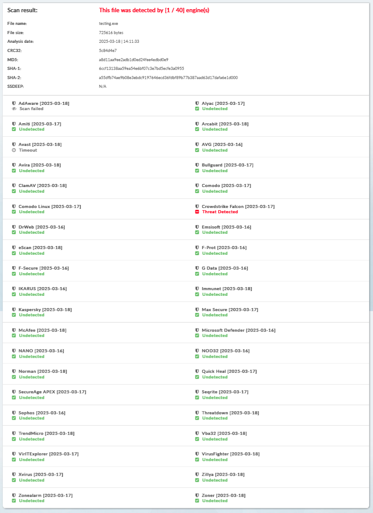
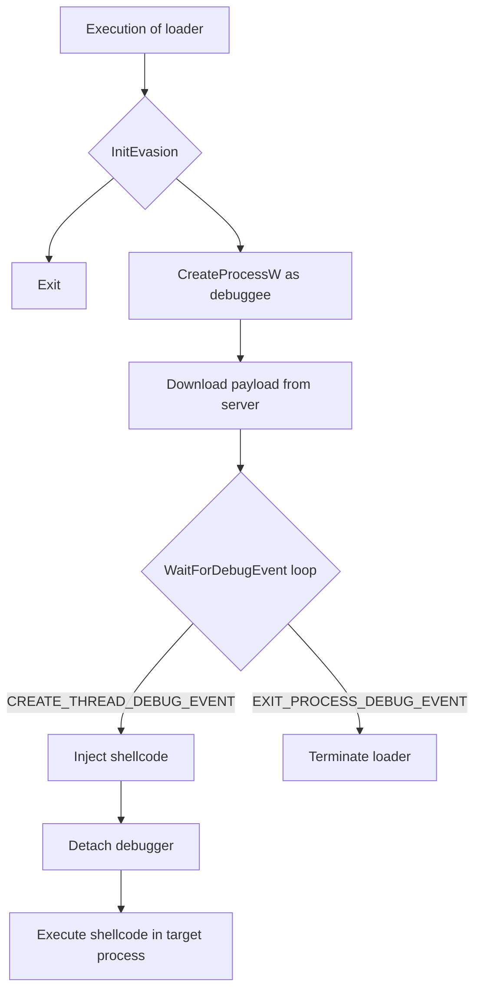

# ProcessHypnosis-LLVM

This is just a Process Hypnosis loader with staged payload and few evasion measures that I have learned from MalDevAcademy (https://maldevacademy.com). The twist is to add LLVM for the signature based detection, that makes life harder for some AVs and sandboxes. 
>**NOTE**: This is just another amateur project for myself just to learn few things. 

## Requirements
1. Installed LLVM (https://github.com/llvm/llvm-project/releases). The best option that worked for me is to use chocolatey to install it and then find corresponding version in repository's Releases and unpack the tarball with all missing stuff in LLVM directory. I have also used [this tutorial](https://www.bordergate.co.uk/llvm-obfuscation/).
2. CMake
3. Visual Studio 2022

## Evasions

With all the evasions listed below, I was able to bypass most antivirus solutions:
1.  Using **InstallShield Setup strings** to reduce the loader's entropy,
2.  **Payload staging**,
3.  Detecting **sleep forwarding**,
4.  Checking for **debugger presence**,
5.  Detecting **API emulation** of `FlsAlloc` and `VirtualAllocExNuma` (WinAPI),
6.  **Execution control manipulation**,
7.  Implementing **custom `GetProcAddress` and `GetModuleHandle` functions**,
8.  **API hashing** using the **Djb2 algorithm**,
9.  **Function call obfuscation**.

## Results from Kleenscan

## Flow
The Process Hypnosis loader works like on chart below:

## Remark
This Process Hypnosis technique works fine, if we want to have an alternative to Early Bird APC Injection or same ol' CRT injection. Yet when I was testing it, it was working fine with **Sliver**, and **Metasploit Framework**. For some reason it wasn't executing correctly on **Havoc** and **Mythic** C2s. I haven't really got time to analize it, but now you know its an issue.

